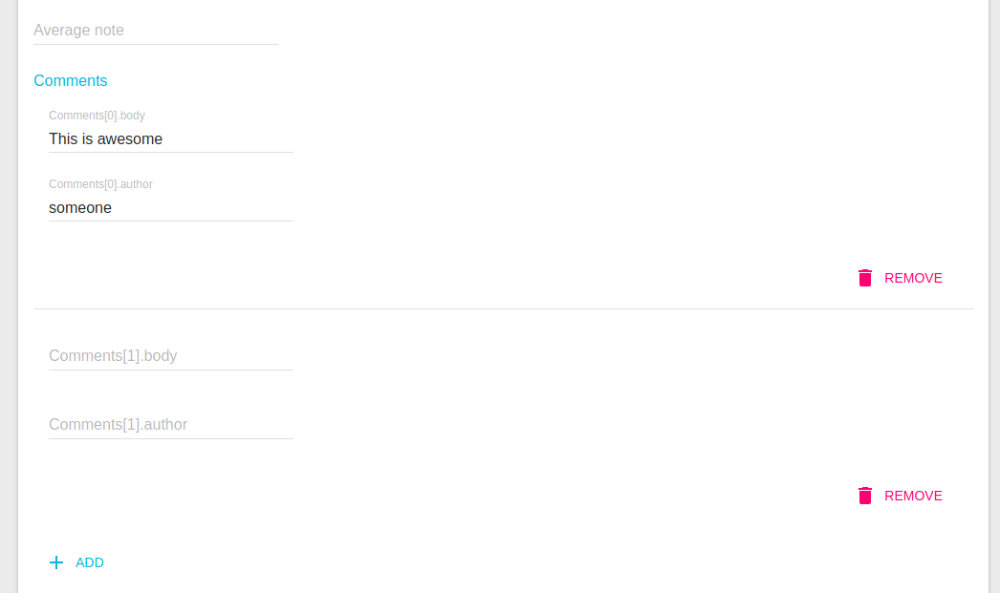

[](https://www.npmjs.com/package/aor-embedded-array)
[](https://www.npmjs.com/package/aor-embedded-array)
[](https://www.npmjs.com/package/aor-embedded-array)
[](https://travis-ci.org/MhdSyrwan/aor-embedded-array)
# aor-embedded-array

A custom field/input component for [Admin-on-rest](https://github.com/marmelab/admin-on-rest/) that provides the ability to represent embedded arrays.



## Installation

Install with:

```sh
npm install --save aor-embedded-array
```

or

```sh
yarn add aor-embedded-array
```

## Usage

### Basic Usage

Define the `Create` and `Edit` View like this:

```jsx
 <EmbeddedArrayInput source="links">
     <LongTextInput source="url" />
     <LongTextInput source="context" />
     <EmbeddedArrayInput source="metadata">
         <TextInput source="name" />
         <TextInput source="value" />
     </EmbeddedArrayInput>
 </EmbeddedArrayInput>
```

Define the `Show` and `List` View like this:

```jsx
 <EmbeddedArrayField source="links">
     <UrlField source="url" />
     <TextField source="context" />
     <EmbeddedArrayField source="metadata">
         <TextField source="name" />
         <TextField source="value" />
     </EmbeddedArrayField>
 </EmbeddedArrayField>
```

For primitive arrays, define the Views the same way but without the source prop for the unique child:

```jsx
 <EmbeddedArrayInput source="links">
     <LongTextInput />
 </EmbeddedArrayInput>
```

### Using Custom action buttons

```jsx
 import FlatButton from 'material-ui/FlatButton';
 import ActionDeleteIcon from 'material-ui/svg-icons/action/delete';
 const CustomDeleteButton = ({items, index}) => (
     <FlatButton
         key={index}
         secondary
         label="Delete"
         icon={<ActionDeleteIcon />}
         onClick={() => {
             // Take custom action
             console.log(items, index);
             items.remove(index);
         }}
     />
 )
```

```jsx
 var style = {
     actionsContainerStyle: {
         display: "inline-block",
         clear: "both",
         float: "right",
         padding: "2em 0em 0em 0em"
     }
 }
 <EmbeddedArrayInput source="links" 
     actionsContainerStyle={style.actionsContainerStyle} 
     customButtons={[<CustomDeleteButton key={0}/>]}
     >
     <UrlField source="url" />
     <TextField source="context" />
 </EmbeddedArrayInput>
```

### Customizing Add and Remove buttons' labels
You can make use of the translation system provided by `admin-on-rest` and set the following translation paths:
1. `aor.input.embedded_array.add` to set Add Button's label.
2. `aor.input.embedded_array.remove` to set Remove Button's label.

Also, you can change the translation path's themselves by providing values for props `labelAdd` and `labelRemove`.

You can learn more about admin-on-rest's translation system from this link: https://marmelab.com/admin-on-rest/Translation.html

### Passing props to customize style

There are four style props you can pass to customize style, those are `actionsContainerStyle`, `innerContainerStyle`, `labelStyle` & `insertDividers`.

Default values of those are as follows

```js
actionsContainerStyle: {
    clear: 'both',
    margin: '1em',
    display: 'block',
    textAlign: 'right',
},
```

```js
innerContainerStyle: {
    padding: '0 1em 1em 1em',
    width: '90%',
    display: 'inline-block',
},
```

```js
labelContainerStyle: {
    padding: '1.2em 1em 0 0',
    width: '90%',
    display: 'inline-block',
},
```

```js
labelStyle: {
    top: 0,
    position: 'relative',
    textTransform: 'capitalize',
},
```

You can also pass `insertDividers` value as `true` or `false` to get the divider or not. Default value for `insertDividers` is true.
